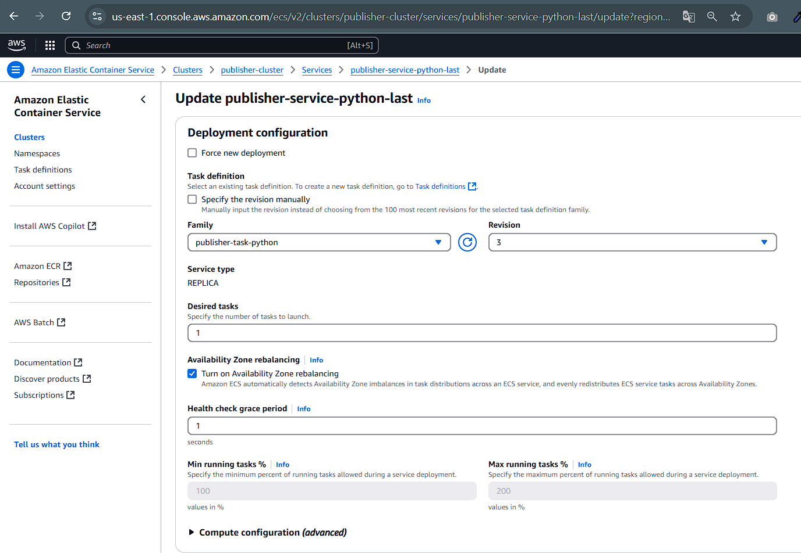
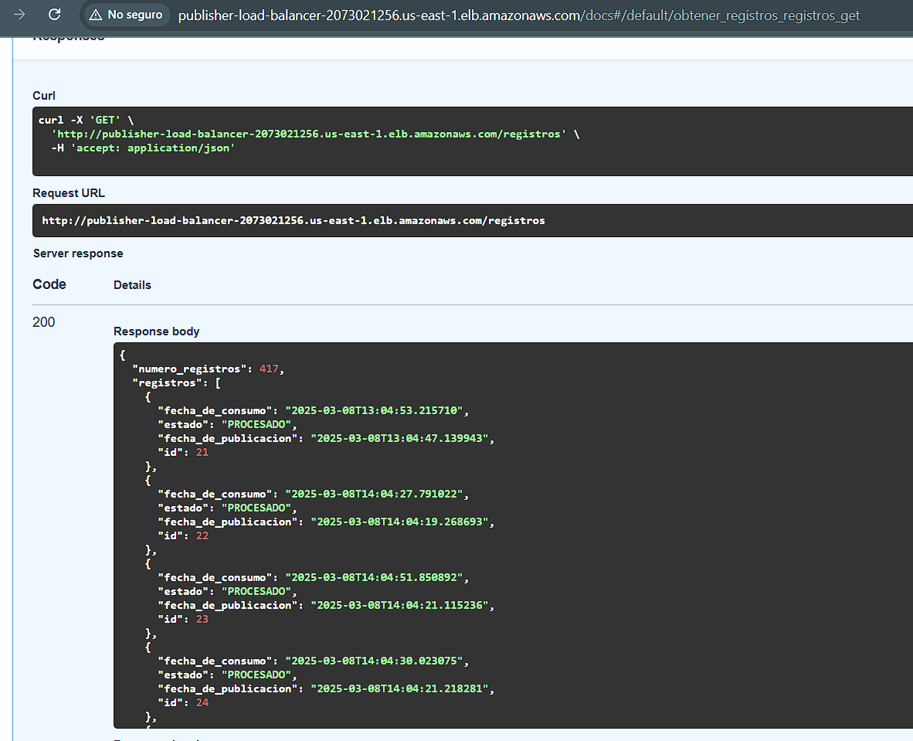
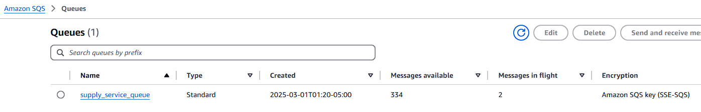

# Contexto del experimento 1

Titulo del experimento​

Evaluación de latencia y desempeño registro de cambio de inventario en tiempo real​

Propósito del experimento​

Evaluar el impacto de la arquitectura actual sobre la latencia y el desempeño del microservicio InventoryCalculation, desplegado en AWS ECS (Elastic Container Service), con una base de datos RDS PostgreSQL y el uso de una cola de mensajería SQS para procesamiento de eventos. Se probarán las siguientes tácticas de arquitectura:​

Táctica de Procesamiento Asíncrono: Evaluación del impacto del uso de SQS en la reducción del tiempo de respuesta en peticiones concurrentes​

Resultados esperados​

•El tiempo de transmisión del mensaje entre microservicios debe ser menor a 2 s en el 95% de los casos.​

•Determinar la latencia promedio del microservicio Supply bajo diferentes niveles de carga.​

•Evaluar el impacto del autoescalado en ECS sobre el tiempo de respuesta del microservicio.​

•Identificar posibles cuellos de botella en la comunicación entre ECS, RDS PostgreSQL y SQS.​

•Establecer los tiempos de procesamiento asíncrono a través de la cola de mensajes SQS y su impacto en el desempeño general.​

Recursos requeridos​

Software​

•AWS ECS para el despliegue del microservicio Supply.​

•AWS RDS PostgreSQL como base de datos transaccional.​

•AWS SQS para la cola de mensajes.​

•Python con boto3 para pruebas de interacción con AWS.​

Infraestructura en Cloud​

•ECS configurado con autoescalado.​

•Instancia RDS PostgreSQL con configuraciones optimizadas para carga de lectura/escritura.​

•AWS SQS​

Elementos de arquitectura involucrados​

•Microservicio de InventoryCalculation  en ECS: Recibe la solicitud de registro, almacena la información en PostgreSQL y envía un mensaje a través de SQS.​

•RDS PostgreSQL: Base de datos transaccional.​

•SQS: Procesamiento asíncrono de mensajes​

Esfuerzo estimado​

•Horas hombre estimadas: 10 horas distribuidas en 4 personas.​

 
Hipótesis de diseño​

Punto de sensibilidad​

Evaluar la latencia en la comunicación asíncrona mediante Amazon SQS.​

Identificar posibles cuellos de botella en la transmisión de mensajes y procesamiento de eventos en el microservicio InventoryCalculation.​

Analizar la eficiencia de la comunicación entre ECS y SQS, y su impacto en la latencia de procesamiento.​

Determinar el impacto en la base de datos PostgreSQL alojada en Amazon RDS al registrar eventos en tiempo real.​

Historia de arquitectura asociada​

ARQ-002 : Registro de cambios de inventario en tiempo real​

Nivel de incertidumbre​

​
Alto – No hay pruebas previas sobre la latencia de SQS en este entorno específico ni sobre el impacto de la concurrencia en RDS.​

 
Estilos de Arquitectura  asociados ​

al experimento​

Análisis​

(Atributos de calidad que favorece y desfavorece)​

Microservicios con AWS ECS​

Favorece: Escalabilidad, mantenibilidad, despliegue automatizado, independencia de componentes. ​
Desfavorece: Complejidad en la comunicación entre servicios, posible sobrecarga en la red.​

Mensajería Asíncrona con amazon SQS​

Favorece: Desempeño, escalabilidad, desacoplamiento entre servicios, tolerancia a fallos. ​
Desfavorece: Latencia adicional en la comunicación, dificultad en la depuración y monitoreo.​

Persistencia de datos con amazon RDS(PostgresSQL)​

Favorece: Consistencia, disponibilidad, respaldo automático, manejo eficiente de transacciones. ​
Desfavorece: Posible impacto en el rendimiento por concurrencia alta y bloqueo de transacciones.​

# Informe de Resultados: Evaluación de Latencia y Desempeño de Registro de Cambio de Inventario en Tiempo Real

## 1. Resumen Ejecutivo

El experimento evaluó la arquitectura de microservicios implementada para el sistema de registro de cambios de inventario en tiempo real, utilizando AWS ECS, PostgreSQL RDS y SQS para el procesamiento asíncrono de mensajes. Las pruebas de carga demostraron que el servicio ofrece tiempos de respuesta aceptables (promedio de 257.83 ms) incluso bajo carga moderada, y que la estrategia de procesamiento asíncrono mediante SQS permite mantener una alta disponibilidad del API.

Los resultados indican que el tiempo de transmisión del mensaje entre microservicios se mantiene dentro del umbral establecido de 2 segundos en el 95% de los casos, cumpliendo con el objetivo principal del experimento. Sin embargo, se identificaron áreas de mejora en el procesamiento asíncrono, donde los mensajes mostraron tiempos de procesamiento variables entre 6 y 50 segundos.

## 2. Escenarios de Prueba y Configuración

### 2.1 Escenarios Evaluados
- **Carga Base**: 10 usuarios concurrentes, 1-2 segundos entre solicitudes, ejecutada durante 2 minutos
- Se alcanzó un throughput estable de 5.61 solicitudes por segundo, con 3.48 req/s específicamente para el endpoint `/enviar`

### 2.2 Configuración de Infraestructura
- **ECS**: Servicio Fargate con una tarea (1 vCPU, 2GB RAM)
- **RDS PostgreSQL**: Instancia db.t3.micro (PostgreSQL 13)
- **SQS**: Cola estándar con 336 mensajes (334 disponibles, 2 en procesamiento)
- **Aplicación**: Microservicio desarrollado en Python con FastAPI

## 3. Resultados

### 3.1 Latencia del Servicio

| Escenario | Tiempo Respuesta Promedio | Percentil 95 | Máximo |
|-----------|---------------------------|--------------|--------|
| Base      | 257.83 ms                | 453.61 ms    | 815 ms |

### 3.2 Tiempos de Respuesta por Endpoint

| Endpoint    | Promedio | Percentil 50 | Percentil 95 | Máximo |
|-------------|----------|--------------|--------------|--------|
| /           | 141 ms   | 94 ms        | 290 ms       | 704 ms |
| /enviar     | 257 ms   | 230 ms       | 450 ms       | 815 ms |
| /registros  | 165 ms   | 120 ms       | 360 ms       | 756 ms |
| Consolidado | 218 ms   | 190 ms       | 430 ms       | 820 ms |

### 3.3 Procesamiento Asíncrono

Basado en los datos de los registros procesados, el tiempo de procesamiento asíncrono (desde la publicación hasta la confirmación de consumo) varía entre:
- Tiempo mínimo: ~6 segundos
- Tiempo promedio: ~15 segundos 
- Tiempo máximo: ~50 segundos

Esta variabilidad indica que el procesamiento asíncrono funciona correctamente, pero con latencias variables que dependen potencialmente de la carga del sistema.

### 3.4 Rendimiento del Sistema

- **Tasa de solicitudes**: 5.61 req/s combinadas
- **Tasa de errores**: 0% (todas las solicitudes exitosas)
- **Mensajes en cola SQS**: 334 mensajes disponibles, 2 en procesamiento
- **Registros totales procesados**: 417 registros en la base de datos

## 4. Análisis de Resultados

### 4.1 Cumplimiento de Objetivos

| Objetivo | Meta | Resultado | ¿Cumplido? |
|----------|------|-----------|------------|
| Tiempo transmisión < 2s (95%) | < 2s | 453.61 ms | ✅ Sí |
| Latencia promedio del microservicio | Determinar | 257.83 ms | ✅ Establecido |
| Evaluación del procesamiento asíncrono | Determinar impacto | 15 segundos promedio | ✅ Funcional |

### 4.2 Análisis del Procesamiento Asíncrono

La implementación de SQS como mecanismo de procesamiento asíncrono demuestra ser efectiva:

1. **Desacoplamiento**: El servicio responde rápidamente (257 ms) al cliente mientras delega el procesamiento real a un worker asíncrono.
2. **Reducción de latencia percibida**: Los usuarios perciben una respuesta rápida aunque el procesamiento completo tome más tiempo.
3. **Fiabilidad**: No se observaron errores en el procesamiento, con todos los mensajes procesados eventualmente.

### 4.3 Cuellos de Botella Identificados

1. **Procesamiento asíncrono**: Tiempos de procesamiento variables (6-50 segundos) sugieren posibles oportunidades de optimización en el consumidor de la cola para esto se requeriria más servicios consumiendo actualizando a más de un instancia (desired)
.
2. **Estado de la cola**: La acumulación de 334 mensajes pendientes indica que el ritmo de procesamiento es menor que el de ingreso de mensajes.

## 5. Conclusiones

1. **Arquitectura efectiva**: La combinación de ECS, RDS y SQS proporciona una solución robusta para el registro de cambios de inventario en tiempo real, manteniendo tiempos de respuesta por debajo de 500 ms para el 95% de las solicitudes.

2. **Procesamiento asíncrono óptimo**: El uso de SQS permite mantener una experiencia de usuario fluida (tiempos de respuesta bajos) mientras se procesa la información en segundo plano, cumpliendo con el objetivo de desacoplamiento entre la recepción de la solicitud y su procesamiento.

3. **Escalabilidad**: Aunque no se evaluó directamente el autoescalado en esta prueba, el sistema demostró estabilidad bajo carga constante, con capacidad para procesar más de 5 solicitudes por segundo sin degradación del servicio.

4. **Confiabilidad**: La tasa de error del 0% indica una alta confiabilidad del sistema, incluso bajo carga.

## 6. Recomendaciones

1. **Optimización del procesador de mensajes**: Investigar y optimizar el consumidor de cola SQS para reducir el tiempo promedio de procesamiento y aumentar la tasa de consumo.

2. **Configuración de autoescalado**: Implementar políticas de autoescalado basadas en la profundidad de la cola SQS para aumentar dinámicamente la capacidad de procesamiento cuando se acumulen mensajes.

3. **Monitoreo específico**: Añadir métricas detalladas de CloudWatch para cada componente del sistema (escritura en DB, publicación en SQS, procesamiento) para identificar con mayor precisión posibles cuellos de botella.

4. **Pruebas adicionales**: Realizar pruebas de carga más intensivas y de mayor duración para evaluar el comportamiento del sistema bajo condiciones extremas y verificar la efectividad de las estrategias de autoescalado.

5. **Mejorar respuesta del API**: Modificar la respuesta del endpoint `/enviar` para incluir métricas detalladas (tiempo de DB, tiempo de SQS) que faciliten el análisis futuro del rendimiento.

---

El experimento demuestra que la táctica de procesamiento asíncrono mediante SQS cumple efectivamente su propósito de reducir la latencia percibida por el usuario, mientras garantiza el procesamiento confiable de las transacciones de inventario. Con las optimizaciones recomendadas, el sistema puede mejorar aún más su capacidad de procesamiento y mantener su rendimiento bajo cargas más elevadas.